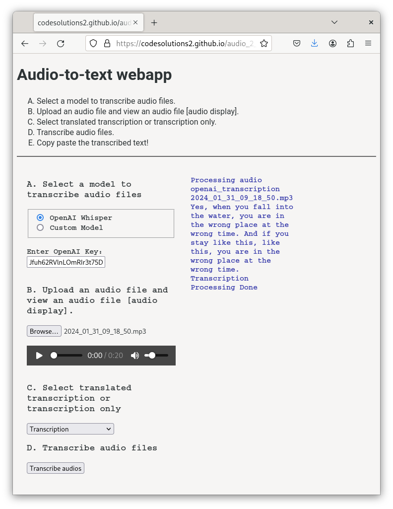

# audio_2_text_journal

The intention of this application is to demonstrate a Productivity application for better everyday responsible self-help. Being active in life means that one is taking action, and learning by reflecting on the responses in their life due to their activity. By recording or writing ideas in a journal, self-discovery and better decision making can be fostered to have a "Happy and Healthy Life". The purpose of this webapp is to create a journal from audio from transcribed audio files, this webapp transcribes audio to text.

Upload your audio file and view the transcription to the right! Keep your transcriptions in your own personal journal, and then use the webapp [text_2_chatbot_journal](https://github.com/CodeSolutions2/text_2_chatbot_journal) to chat with a chatbot/your **digital twin** with your journal using your OpenAI account (at the moment). 

Ask yourself questions about the things you talked about in your journal to obtain more clarity and insight in your life! 

[**Upload your data to the FrontEnd App Here**] https://codesolutions2.github.io/audio_2_text_journal/index.html

https://codesolutions2.github.io/audio_2_text_journal/test.html
